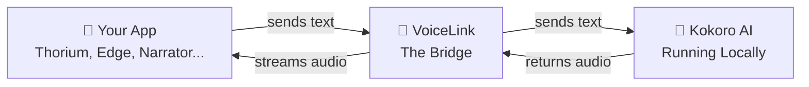

  

  <h1>VoiceLink</h1>

  
<strong>Natural sounding AI voices for every Windows app.</strong>

  

    
    
    
    
  

 

Windows ships with a handful of voices that sound robotic and outdated. Meanwhile, AI voices that sound almost human already exist as open source projects, but none of them work with your everyday apps.

**VoiceLink changes that.** It makes AI voices show up as regular Windows voices. Pick one from the dropdown in Thorium Reader, Microsoft Edge, Narrator, or any app that reads text aloud and hear the difference instantly.

No technical knowledge needed. Install it, choose a voice, and enjoy listening.

 

## 🎧 Listen to the Voices

All samples below are generated by the [Kokoro](https://github.com/hexgrad/kokoro) model running entirely on a local machine. Click any sample to listen.

> *"The old bookshop on the corner had a peculiar charm about it. Dust motes danced in the sunlight that streamed through tall windows, and the smell of aged paper filled every room. It was the kind of place where you could lose an entire afternoon without even noticing."*

#### American English

| Voice | Style | Listen |
|:------|:------|:------:|
| **Heart** | Warm and expressive, great for audiobooks | [▶ Play](docs/audio/af_heart.wav) |
| **Bella** | Clear and professional | [▶ Play](docs/audio/af_bella.wav) |
| **Nicole** | Smooth and calm | [▶ Play](docs/audio/af_nicole.wav) |
| **Adam** | Natural and conversational | [▶ Play](docs/audio/am_adam.wav) |
| **Michael** | Deep and authoritative | [▶ Play](docs/audio/am_michael.wav) |

#### British English

| Voice | Style | Listen |
|:------|:------|:------:|
| **Emma** | Classic British accent | [▶ Play](docs/audio/bf_emma.wav) |
| **George** | Refined British accent | [▶ Play](docs/audio/bm_george.wav) |

> VoiceLink ships with **11 voices** in total (7 American, 4 British). See [all voices](#-all-available-voices) below.

 

## 📸 Screenshots

  
   
  <em>Dashboard: monitor the voice server and see system status at a glance</em>

  
   
  <em>Voice Manager: rename voices, toggle them on or off, preview with one click</em>

  
   
  <em>Setup Wizard: downloads everything automatically on first run</em>

 

## 🖥️ Works Everywhere

VoiceLink voices appear in any Windows app that supports text to speech. Here are a couple of examples:

  
  &nbsp;&nbsp;
  

  <em>Left: Thorium Reader &nbsp;·&nbsp; Right: Microsoft Edge Read Aloud</em>

 

## 🔗 How It Works

VoiceLink registers itself as a standard Windows voice. When any app asks it to speak, it quietly passes the text to an AI model running on your machine and streams back natural sounding audio. Your apps never know the difference. They just see another voice in their dropdown list.

Everything runs on your computer. No internet needed after the initial setup. No cloud services. Your text never leaves your machine.

> 🔍 Want to understand the full architecture? Read the [Deep Dive Manual](DEEP_DIVE.md), a comprehensive technical reference covering every layer of the system.

 

## 🚀 Getting Started

### What You Need

- Windows 10 or 11 (64 bit)
- About 1.5 GB of free disk space (+ ~3 GB for Qwen3 TTS if enabled)
- An internet connection for the first setup (to download the AI model)
- A reasonably modern computer (a dedicated GPU helps but is not required)
- **For Qwen3 voices / voice cloning:** An NVIDIA GPU with at least 4 GB VRAM

### Installation

1. **Download** the installer from the [latest release](https://github.com/ManveerAnand/VoiceLink/releases/latest)
2. **Run it** as Administrator (right click → Run as administrator)
3. **Follow the setup wizard** (it handles everything automatically):
   - Downloads a self contained Python environment
   - Installs all dependencies
   - Downloads the AI voice model and all voice packs
   - Starts the local voice server
   - Registers 11 AI voices in Windows
4. **Open any app** that reads text aloud (Thorium Reader, Edge, Narrator, Balabolka, etc.)
5. **Pick a VoiceLink voice** from the voice list
6. **Enjoy!**

No terminal commands. No configuration files. No Python installation. Just install and go.

### Where Things Are Stored

| Location | What is there |
|:---------|:-------------|
| `C:\ProgramData\VoiceLink\python\` | Self contained Python environment with all packages |
| `C:\ProgramData\VoiceLink\models\` | AI voice model and voice pack data |
| `C:\ProgramData\VoiceLink\server\` | Local voice server |
| `C:\Program Files\VoiceLink\` | The app itself |

 

## 🗣️ All Available Voices

VoiceLink ships with **11 voices** powered by the [Kokoro](https://github.com/hexgrad/kokoro) model, plus **6 additional voices** and **voice cloning** through [Qwen3-TTS](https://github.com/QwenLM/Qwen3-TTS) (requires NVIDIA GPU):

### Kokoro Voices

| Voice | Accent | Gender | Description |
|:------|:-------|:-------|:------------|
| Heart | 🇺🇸 American | Female | Warm, expressive (the default voice) |
| Bella | 🇺🇸 American | Female | Clear and professional |
| Nicole | 🇺🇸 American | Female | Smooth and calm |
| Sarah | 🇺🇸 American | Female | Friendly, conversational |
| Sky | 🇺🇸 American | Female | Light and youthful |
| Adam | 🇺🇸 American | Male | Natural, conversational |
| Michael | 🇺🇸 American | Male | Deep and authoritative |
| Emma | 🇬🇧 British | Female | Classic British English |
| Isabella | 🇬🇧 British | Female | Elegant and refined |
| George | 🇬🇧 British | Male | Traditional British English |
| Lewis | 🇬🇧 British | Male | Warm British voice |

### Qwen3 Voices (GPU only, optional)

| Voice | Gender | Description |
|:------|:-------|:------------|
| Serena | Female | Warm and gentle |
| Vivian | Female | Bright and expressive |
| Aiden | Male | Clear American midrange |
| Ryan | Male | Dynamic with strong rhythm |
| Dylan | Male | Youthful and natural |
| Eric | Male | Lively with bright timbre |

Plus **voice cloning**: clone any voice from a 3-second audio clip. Qwen3-TTS is accelerated with CUDA graphs via [faster-qwen3-tts](https://github.com/andimarafioti/faster-qwen3-tts) for ~1x realtime generation.

More voices and additional AI models are planned for future releases.

 

## 📊 Project Status

VoiceLink is functional and usable today. Here is where things stand:

| Component | Status | Details |
|:----------|:------:|:--------|
| AI Voice Server | ✅ | Local server powered by Kokoro (11 voices) and Qwen3-TTS (6 voices + voice cloning) |
| Qwen3-TTS Engine | ✅ | Optional GPU-accelerated engine with CUDA graphs (~1x realtime on RTX 4060) |
| Windows Voice Driver | ✅ | Registered as a standard Windows voice, works in any compatible app |
| Desktop App | ✅ | Dashboard, voice manager, voice studio (clone voices), system tray, server controls |
| Installer | ✅ | Setup wizard that downloads and configures everything automatically |
| CI/CD Pipeline | ✅ | Automated builds and releases through GitHub Actions |

Check [TASKS.md](TASKS.md) for the detailed roadmap.

 

## 💡 Why This Exists

I was reading ebooks in Thorium Reader and the built in Windows voices were genuinely painful to listen to. AI voices that sound incredible exist as open source projects, but there was no simple way to plug them into everyday Windows apps.

So I built the bridge myself. This project is as much about understanding the technology deeply as it is about shipping something useful. If you want to see how every piece fits together, the [Deep Dive Manual](DEEP_DIVE.md) covers it all.

 

## 🤝 Want to Help?

This is an open project. Whether you write code, design interfaces, or just want better voices on Windows, you are welcome here. Open an issue, start a discussion, or star the repo if you think this should exist.

 

## 📄 License

MIT. See [LICENSE](LICENSE) for details.

 

  Built by <a href="https://github.com/ManveerAnand">Manveer Anand</a>

